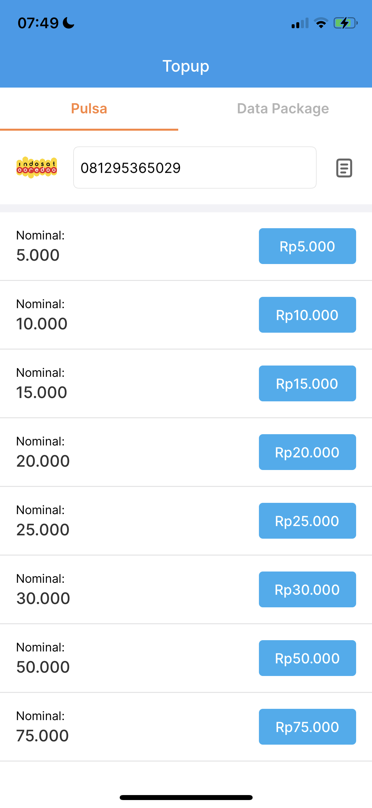
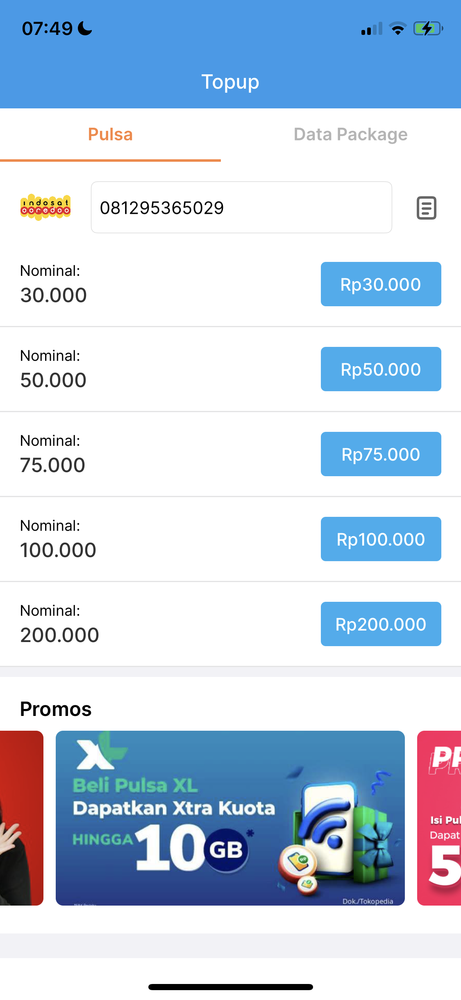
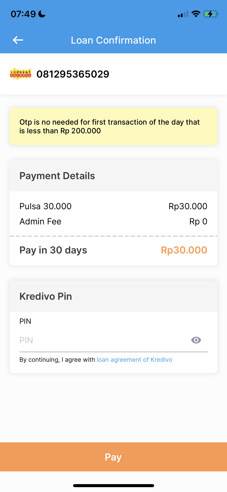
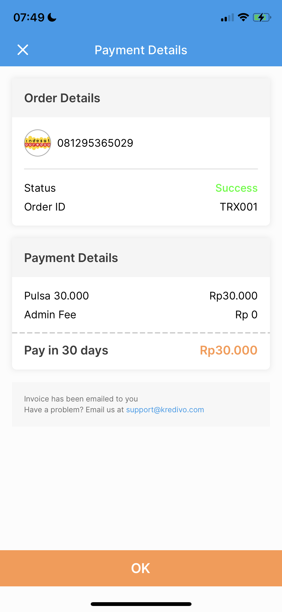
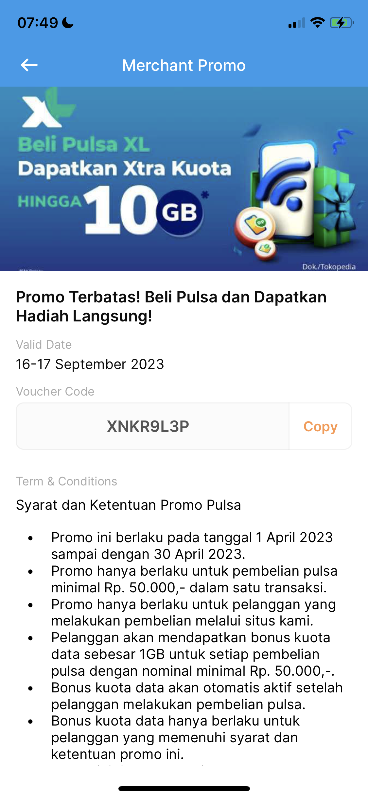

# MyPulsa

This project is part of the test process as an iOS Developer at FinAccel created using Swift programming language. It consists of several screens including Pulsa, Data Package, Promo, and payment screens.

## Features

- Pulsa Screen
- Data Package Screen
- Promo Details
- Confirmation Screen
- Payment Details Screen

## Screenshots

 
 

## Requirements

- Xcode 12 or higher
- Swift 5.0 or higher
- iOS 12.0 or higher

## Installation

1. Clone the repository
2. Run the Project

#Usage
1. On Pulsa & Data package screen, you can enter your number, but when the page is opened for the first time, it will appear the default number. You can choose phone number from your contact.
2. On Pulsa screen, you can see the promo section, and you can select the promo that you want to know the details.
3. On Promo screen, you can copy the promo code by tapping copy button
4. On confirmation screen, you must input your pin. 

## Dependency
1. Tabman
2. RxSwift
3. Toast
